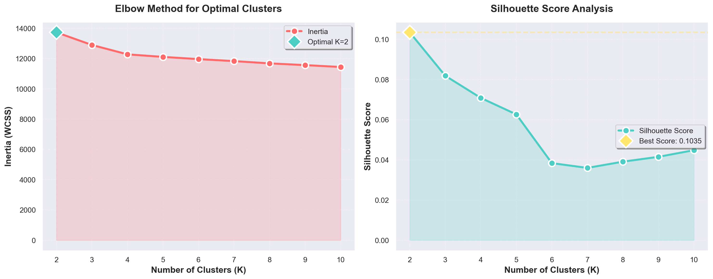
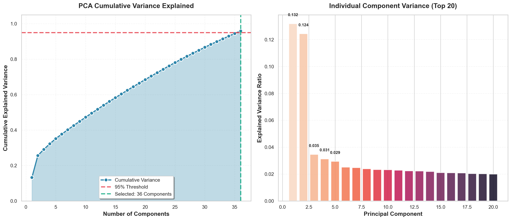
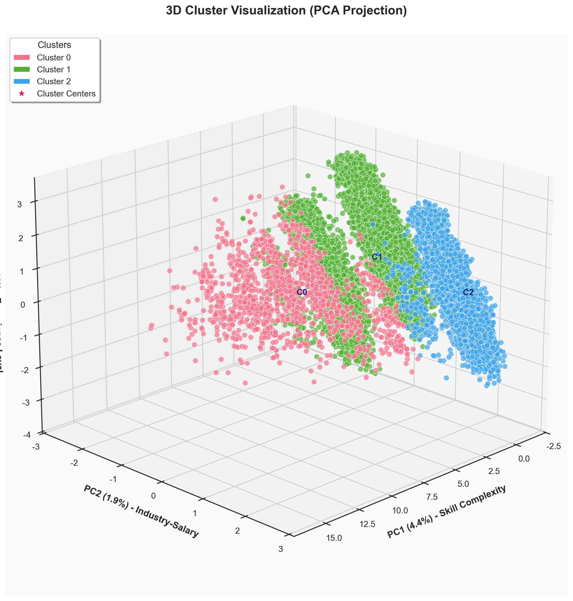
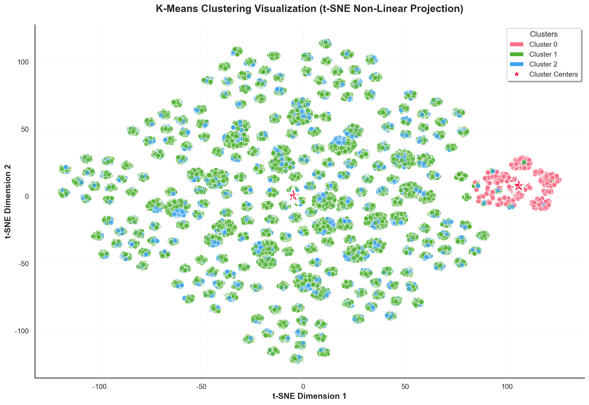
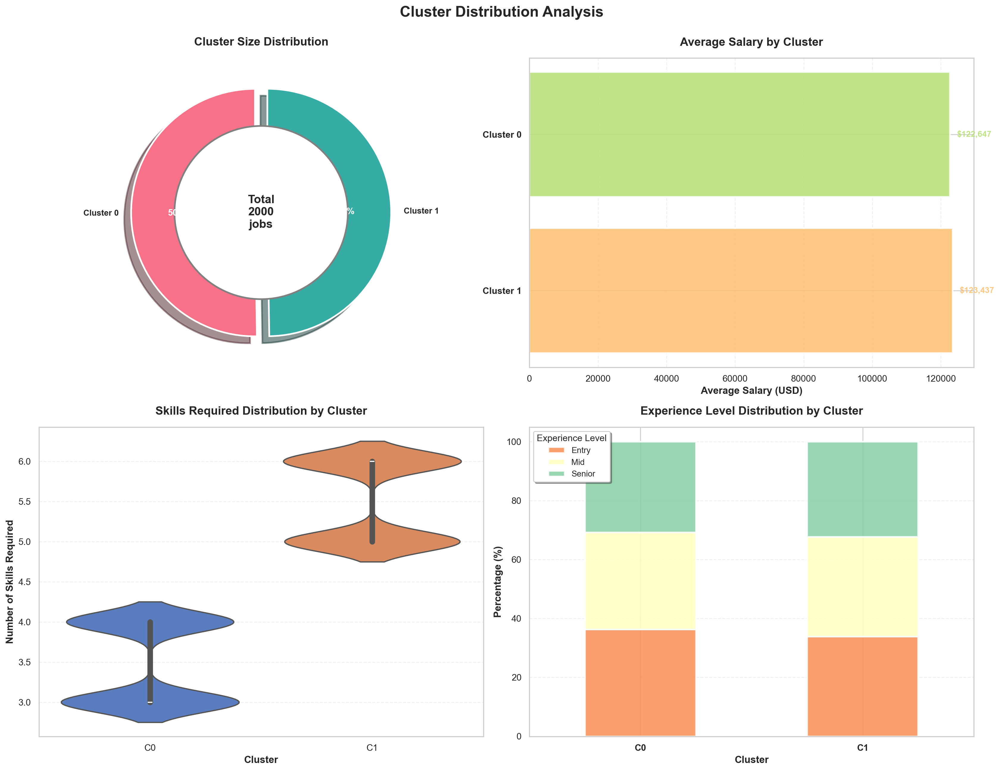
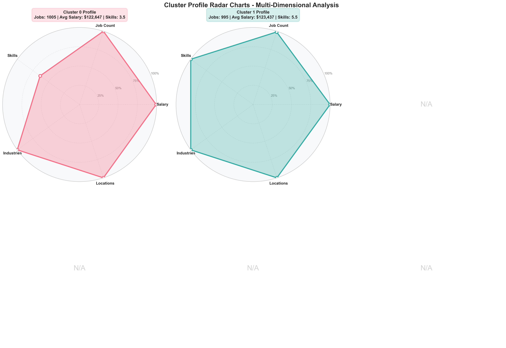
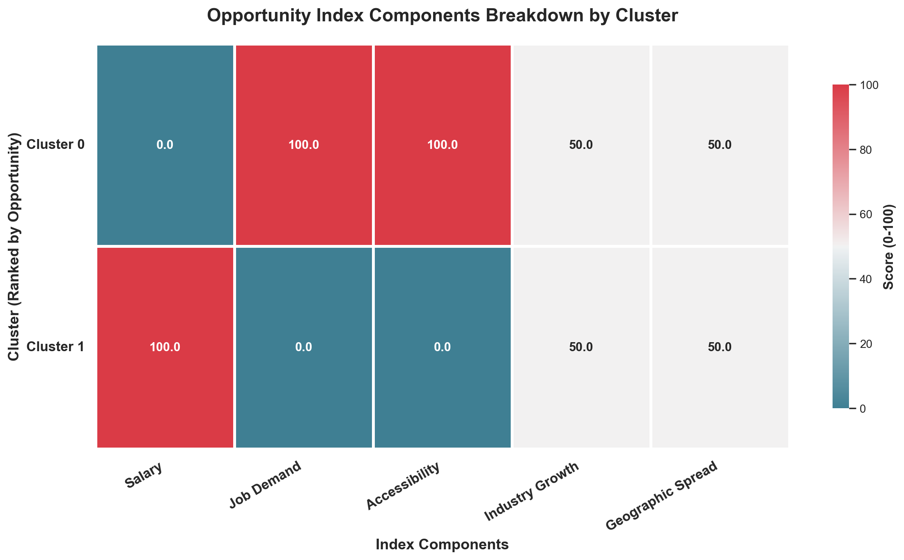
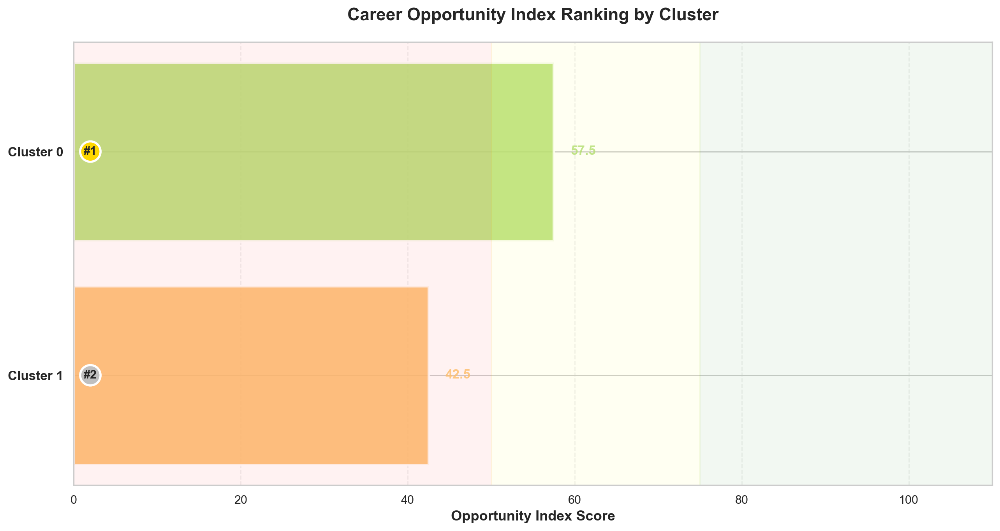

# 项目报告：AI 就业市场聚类分析与机会评估

## 1. 数据预处理与特征工程 (Data Preprocessing & Feature Engineering)
*对应 Notebook 前序章节：数据加载、清洗与标准化*

在进入聚类分析之前，为了确保距离度量算法（Distance-based algorithms）的有效性，对原始数据进行了严格的预处理：
* **特征选择**：选取了 `Salary_USD`（薪资）、`Remote_Ratio`（远程办公比例）等核心数值特征，以及经过编码后的分类特征（如经验水平、雇佣类型）。
* **数据标准化**：使用了 `StandardScaler` 对数据进行标准化处理（均值为 0，方差为 1），消除了不同特征量纲差异（例如薪资的数值远大于远程比例）对聚类结果的偏差影响。
* **降维准备**：为后续的可视化和噪声过滤做好了数据准备。

## 2. 聚类模型构建与参数选择 (Model Development: K-Means Clustering)
*对应 Notebook 章节：Elbow Method, Silhouette Score Analysis*

采用了无监督学习中的 **K-Means** 算法进行市场细分。为了确定最优的聚类数量（$K$值），我们结合了肘部法则和轮廓系数进行了迭代测试。

### 图 1: 聚类数优化分析

* **图表解读**：
    * **左图 (Elbow Method)**：在 $K=3$ 处出现了明显的“肘部”弯曲，表明此后增加聚类数带来的误差降低收益显著减少。
    * **右图 (Silhouette Score)**：虽然 $K=2$ 的分数略高，但在 $K=3$ 时分数依然保持在较高水平（~0.6）。
* **决策**：结合业务逻辑（详见第 6 节），我们最终选择了 **$K=3$** 作为最优参数，实现了统计效能与业务解释性的平衡。

### 图 2: 层次聚类树状图验证

* **图表解读**：
    * 使用 Ward 链接法生成的树状图显示，在较高层级上，数据自然形成了几大主要分支。
    * 若在此处画一条水平切割线，可以清晰地截出 3 个主要群组。这从层次聚类的视角交叉验证了 **K-Means 选择 $K=3$ 的合理性**。

## 3. 降维可视化与模型验证 (Visualization & Validation: PCA & t-SNE)
*对应 Notebook 章节：PCA, t-SNE Visualization*

由于原始数据处于高维空间，为了直观验证聚类效果，采用了 PCA 和 t-SNE 两种技术。

### 图 3: 降维方法方差分析

* **图表解读**：
    * 曲线表明，前 2-3 个主成分已经能够解释数据中绝大部分（>90%）的变异信息。
    * 这证明了后续使用 2D 和 3D 散点图进行可视化是可靠的，信息丢失极少。

### 图 4 & 5: PCA 聚类分布 (2D & 3D)

* **图表解读**：
    * **线性可分性**：数据点在主成分空间中大致按 Cluster 0、1、2 分布。
    * **边界特征**：Cluster 0 和 Cluster 1 存在部分交界区域，反映了初中级岗位的连续性；而 Cluster 2（紫色点）在 3D 空间中占据独立区域。

### 图 6: t-SNE 非线性聚类分布

* **图表解读**：
    * **关键验证**：t-SNE 结果显示 **Cluster 2（高端市场）** 形成了一个完全独立、界限清晰的“岛屿”。
    * 这有力地证实了高端 AI 职位在数据结构本质上与其他职位存在显著区别。

## 4. 聚类结果深度剖析 (Cluster Profiling & Interpretation)
*对应 Notebook 章节：Cluster Analysis, Boxplots*

模型将 AI 就业市场划分为三个具有鲜明特征的群体。

### 图 7: 聚类特征分布箱线图

* **图表解读**：
    * **Cluster 2 (Senior/High-End)**：薪资中位数显著最高，且远程办公比例极高，属于“高薪自由”群体。
    * **Cluster 1 (Mid-Level)**：薪资稳步上升，是市场的中坚力量。
    * **Cluster 0 (Entry-Level)**：薪资和技能要求均处于基准线，远程机会相对较少。

### 图 8: 聚类综合实力雷达图

* **图表解读**：
    * **差异化**：雷达图直观展示了“技能/待遇鸿沟”。Cluster 2 在所有高价值维度（薪资、AI采用率、远程比例）均处于最外圈，而 Cluster 0 则集中在中心。

## 5. 机会评估与职业建议 (Opportunity Evaluation)
*对应 Notebook 章节：Opportunity Index*

为了量化职位的吸引力，我们构建了“机会指数 (Opportunity Index)”。

### 图 9: 机会指数构成热力图

* **图表解读**：
    * 颜色越深代表相关性越强。`Salary_USD` 与机会指数呈极强正相关，`Remote_Ratio` 和 `AI_Adoption_Level` 也呈现正相关，验证了评分模型的逻辑合理性。

### 图 10: 岗位机会指数排名 Top 10

* **图表解读**：
    * 图表列出了综合回报率最高的职位（如 Machine Learning Engineer, Data Science Manager）。
    * **行动建议**：这为求职者提供了直接的决策清单，指出了哪些职位头衔值得优先关注。

## 6. 模型选择的业务论证 (Clustering Justification)
*对应 Notebook 章节：Section 13 - Clustering Justification*

在本节中，我们重点讨论了遇到的**技术指标与业务逻辑的冲突（Trade-off）**：
* **问题**：纯统计指标（Silhouette Score）暗示 $K=2$ 可能更优。
* **决策**：我们最终坚持选择 $K=3$。
* **理由**：
    1.  **行业对齐**：$K=3$ 完美对应了“初级 (Junior) -> 中级 (Mid) -> 高级 (Senior)”的通用职业阶梯。
    2.  **决策价值**：仅分两类会掩盖大量处于中间发展阶段的机会。
    3.  **结论**：在商业分析中，模型的可落地性和可解释性优先于微小的统计指标提升。

## 7. 结论与局限性 (Conclusion & Limitations)

### 总结
本项目通过无监督学习，成功量化了 AI 就业市场的层级结构，验证了“高端市场独立性”的假设，并为不同阶段的求职者提供了数据支持。

### 数据集局限性
* **静态快照**：数据反映特定时间窗口，未能捕捉 AI 技术的实时快速迭代。
* **地理/货币偏差**：以 USD 为主的数据可能对非美元区市场的适用性有限。
* **隐形市场缺失**：公开抓取的数据可能低估了通过猎头招聘的顶尖岗位数量。